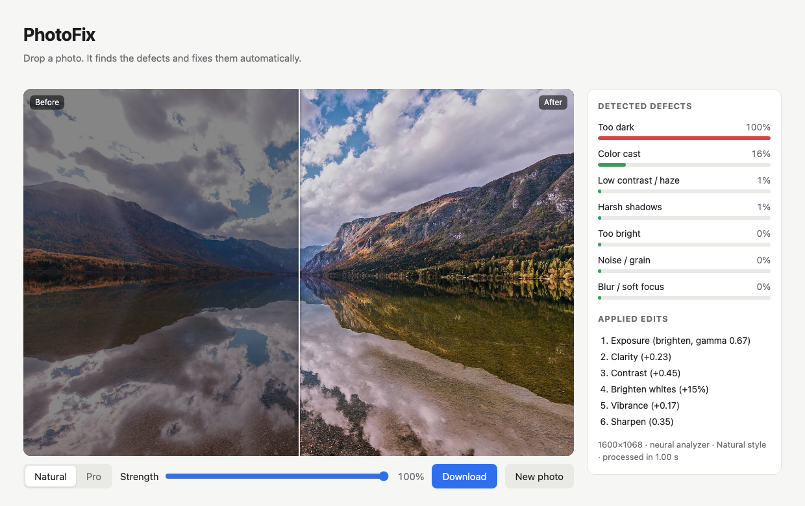
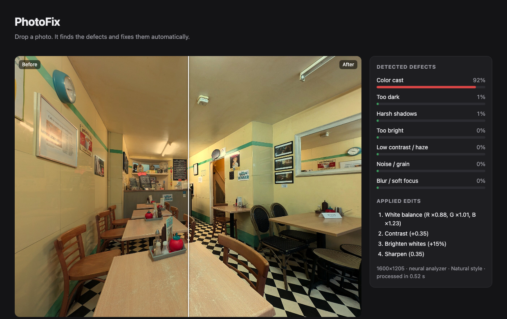

# PhotoFix: case study

An automatic photo editor that finds what is wrong with a picture, fixes only that, and checks its own result
for over-editing before showing it.

[Code and benchmarks](../README.md) · [Trained weights on Hugging Face](https://huggingface.co/Samdany/photofix-models)

**3** neural models · trained on **one M1 Pro laptop** · **1–2 s** per photo on 2 CPUs · **51** tests

## The problem with auto-enhance

One-tap enhance buttons tend to treat every photo the same way: brighter, more contrast, more saturation. That
helps a dark snapshot and hurts a moody dusk scene, a deliberate silhouette, or a portrait that already looked
right. The goal for PhotoFix was narrower and harder to fake: detect specific defects (exposure, contrast, harsh
shadows, color casts, noise, blur), fix only those, and leave good photos alone.

"Leave good photos alone" needs a number, so every stage was scored on **change to already-good photos**: the
average color difference (CIE ΔE) between a clean photo and what the editor returned for it. Below about 2.3 ΔE,
the change is invisible.

## Decide on a preview, render at full resolution

Each model looks at a small image, while every edit is a deterministic operation on the original pixels: a tone
curve, a color lookup table, or a restoration network run in overlapping tiles. Output quality therefore never
depends on a model's input size. Every stage began as a classical method and was replaced only when a learned
model beat it on a fixed benchmark.

| Stage | What it does | Model | Runs |
|---|---|---|---|
| Analyzer | Probability of 7 defects from a global view and a native-resolution crop | EfficientNet-B0 ×2 | always |
| Restorer | Removes noise, blur and JPEG artifacts | NAFNet | only if noisy or blurry |
| Style | Natural: rule-based fixes. Pro: color and tone learned from a retoucher | 3D LUT | Pro only |
| Edits and finishing | Local tone mapping, then contrast, whites, vibrance, sharpening as needed | parametric | full resolution |
| Guardrail | Checks the result and tones it down if it went too far | 5 checks | every edit |

## What each stage taught

**Phase 0: a measurable baseline.** Hand-tuned image statistics, a synthetic damage generator (exposure, haze,
casts, noise, blur, JPEG) and an evaluation harness that every later model reports against. The baseline fixed
damaged photos reasonably well, and it also changed clean photos by 7.35 ΔE on average, plainly visible.
*Color-cast rules cannot tell an orange cat from an orange cast. The baseline neutralized both.*

**Phase 1: a neural analyzer with two views.** Exposure and color need the whole frame; noise and blur disappear
when a photo is shrunk. The analyzer gets both: the whole photo at 224², and a native-resolution crop, each through
its own EfficientNet-B0. It outputs *whether* a defect is present; image statistics still decide *how much* to
correct. Trained for 35 minutes, it cut the change to good photos from 7.35 to 2.67 ΔE.
*Reviewing the worst cases by eye found a bug no metric flagged: lifting shadows multiplied faint color in
near-black areas and turned silhouettes bright blue.*

**Phase 2: a style learned from a professional.** Scored against a retoucher's edits (MIT-Adobe FiveK), the
rule-based pipeline moved photos *further* from the professional than doing nothing. An Image-Adaptive 3D LUT fixed
that: a small network predicts a per-photo color table from a thumbnail. Version 1 matched the expert best, then
turned skin grey on phone photos, because every training input was an unprocessed camera file and it had never seen
a finished picture. Version 3 adds 40% finished-photo-to-itself training samples and only keeps checkpoints that
leave finished photos visually unchanged. It gives up 0.3 dB of accuracy for natural skin.
*Neither style won on real phone photos, so Natural and Pro ship side by side and the user chooses.*

**Phase 3: neural denoising and deblurring.** A compact NAFNet (3.9M parameters) trained for 70 minutes on crops
with camera-like noise and blur. It beats NL-means and unsharp masking on every type of damage, and runs only when
the analyzer flags noise or blur, so clean photos never reach it.
*An untrained model was supposed to be a no-op but degraded images by 8 dB. Its output layer started with random
weights; zero-initializing it made training start from "change nothing".*

**Phase 4: a guardrail on the output.** Every earlier stage decides from the input. The guardrail compares the
result with the original for blown highlights, crushed shadows, skin-tone shifts, garish color and amplified noise,
and blends the edit back just far enough to pass, with a note saying why.
*The first skin check used color alone and flagged orange sunset clouds as skin. It now looks only inside faces
found by a small face detector.*

**Phase 5: people get the final say.** Metrics and eyes disagreed more than once: the finishing pass lowered PSNR
yet looked clearly better, and the best-scoring LUT made faces pale. PhotoFix includes a blind A/B rating page with
a Bradley–Terry leaderboard, where the unedited original competes too, so "was editing worth it?" is measured as well.

## Results

All numbers are on held-out data the models never trained on, and every one can be reproduced with a script in the
repository.

| | |
|---|---|
| **2.65 ΔE** | change to already-good photos, down from 7.35 for the classical baseline |
| **+1.8 dB** | closer to a professional retoucher than the rule-based style |
| **+2.9 dB** | neural denoising over the classical NL-means filter |
| **78%** | of damaged test photos measurably improved, up from 70% |

**End to end** (300 damaged DIV2K photos):

| Pipeline | PSNR (dB) ↑ | Change to good photos (ΔE) ↓ |
|---|---|---|
| Damaged input | 17.15 | n/a |
| Classical baseline | 18.84 | 7.35 |
| + neural analyzer | 19.62 | 2.67 |
| + finishing pass | 19.45 | 2.85 |
| + neural restorer | 19.68 | 2.85 |
| **+ guardrail (shipped)** | **19.81** | **2.65** |

**Against a professional retoucher** (MIT-Adobe FiveK Expert C, 492 photos):

| Variant | PSNR vs expert (dB) ↑ | Change to finished photos (ΔE) ↓ |
|---|---|---|
| Rule-based (Natural) | 20.65 | n/a |
| No edit | 21.01 | 0 |
| Learned LUT v1 | 22.70 | 4.75 |
| **Learned LUT v3 (Pro)** | **22.41** | **2.45** |

**Neural restoration vs the classical filter** (400 validation crops, PSNR dB):

| Damage | Input | Classical | Neural | Neural gain |
|---|---|---|---|---|
| Noise | 28.40 | 29.14 | 32.02 | +2.88 |
| Noise + blur | 23.49 | 24.08 | 25.50 | +1.42 |
| JPEG artifacts | 32.57 | 32.25 | 33.21 | +0.96 |
| Blur | 26.23 | 26.63 | 27.02 | +0.39 |

## The app

A FastAPI server and a plain HTML front end with no build step. It shows each detected defect with a confidence
bar, lists every edit it applied, and offers a strength slider and a Natural/Pro switch. It reads iPhone HEIC files,
handles large photos in tiles, and processes uploads in memory without storing them.

## Limits and next steps

- **Intent.** A deliberately dark or bright photo (a silhouette, a night sky, a white backdrop) can still be
  over-corrected. Telling a choice from a mistake needs scene understanding the current models lack.
- **Region-aware editing.** Edits are global or tone-based. Segmenting sky, people and background would let each get
  its own treatment, and is the most promising next step.
- **Real-world restoration data.** Deblurring gains are modest (+0.4 dB), and restoration was validated on synthetic
  damage because modern phones already denoise heavily.
- **Hosting.** The app has a public mode and a Dockerfile for Cloud Run or Hugging Face; for now it runs locally,
  with the pretrained weights a single download away.

---

**Stack:** Python, PyTorch (Apple MPS), OpenCV, FastAPI, vanilla JavaScript, Playwright. **Data:** DIV2K
(academic use), MIT-Adobe FiveK (research use only). **Architectures** re-implemented from Zeng et al. 2020 (3D LUT)
and Chen et al. 2022 (NAFNet); face detection with YuNet (MIT). Example photos are CC0 from Wikimedia Commons
(Syced, DimiTalen, Ales Krivec, Andy Li, Wilfredor, Gerda Arendt).
